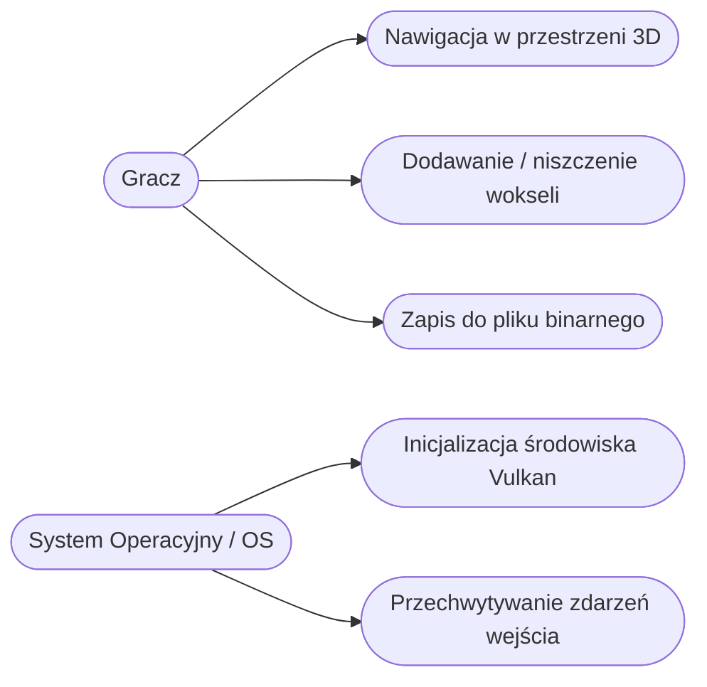
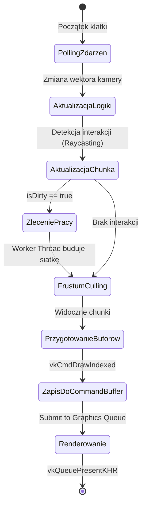
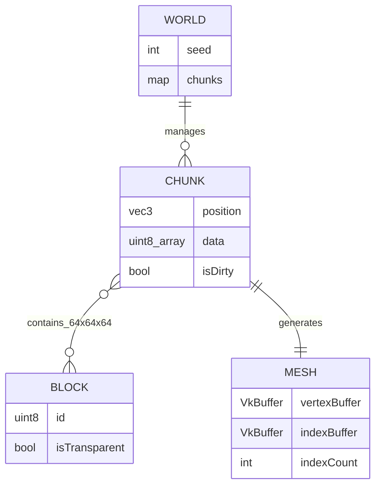
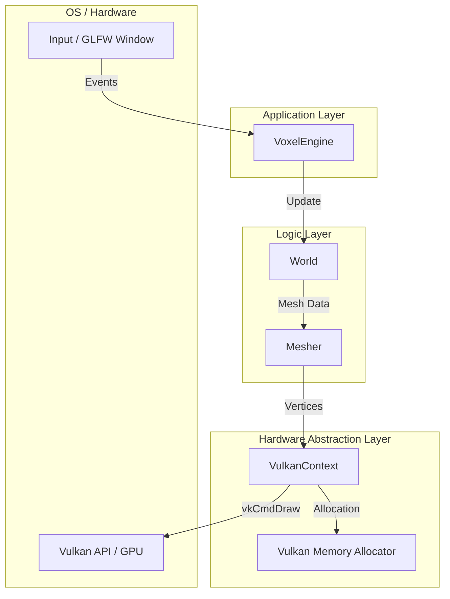
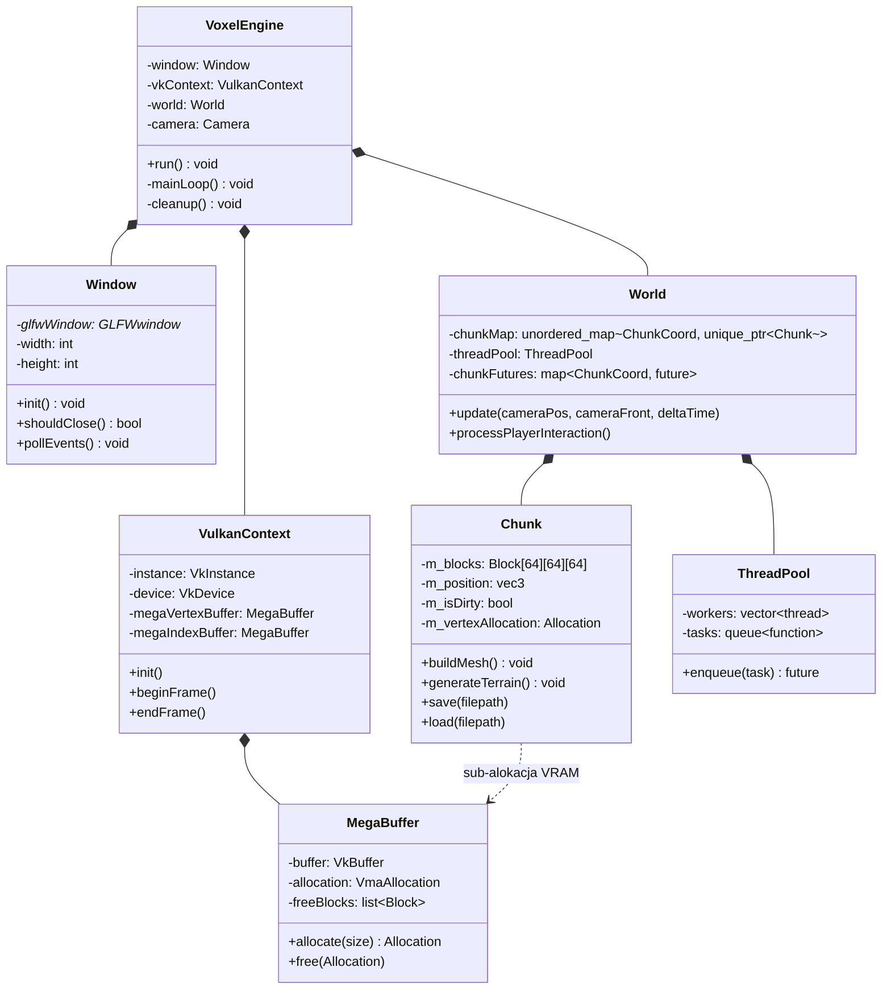
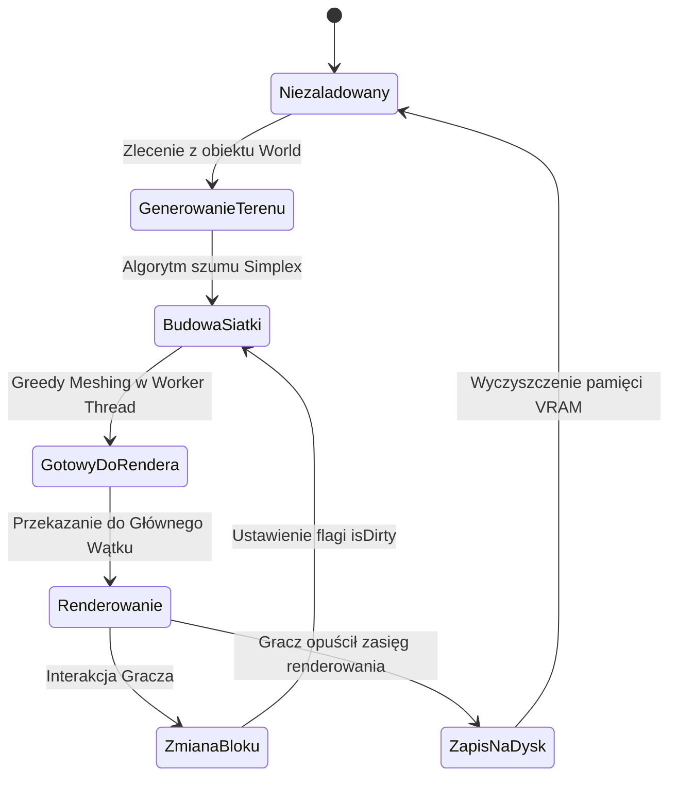
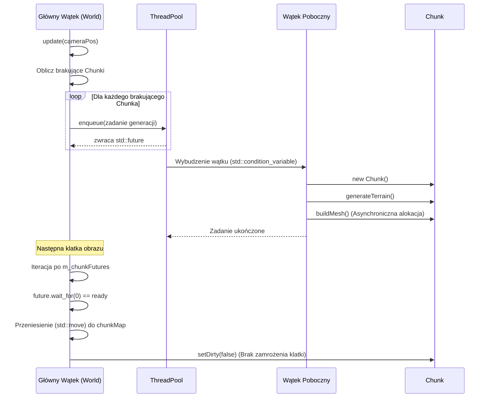

WARSZAWSKA WYŻSZA SZKOŁA INFORMATYCZNA

Projekt Indywidualny

Mikołaj Siwek  
Nr albumu: 10772

Projekt wokselowego

silnika graficznego

Warszawa 2026

# 1.           Spis treści

[1.      Spis treści 2](#_Toc229693456)

[2.      Sformułowanie tematu projektu indywidualnego. 2](#_Toc229693457)

[3.      Krótki opis przeznaczenia i działania systemu. 3](#_Toc229693458)

[4.      Lista podstawowych funkcji realizowanych przez system.. 3](#_Toc229693459)

[5.      Przegląd istniejących rozwiązań. 3](#_Toc229693460)

[6.      Analiza biznesowa. 4](#_Toc229693461)

[7.      Analiza prawna. 4](#_Toc229693462)

[8.      Narzędzia wspomagające realizację projektu na etapie analizy. 4](#_Toc229693463)

[9.      Opis wymagań funkcjonalnych. 4](#_Toc229693464)

[10.        Opis wymagań niefunkcjonalnych. 5](#_Toc229693465)

[11.        Opis przypadków użycia. 5](#_Toc229693466)

[12.        Diagramy UML przypadków użycia. 6](#_Toc229693467)

[13.        Diagram UML stanów lub czynności 6](#_Toc229693468)

[14.        Projekt interfejsu użytkownika i wytyczne WCAG.. 6](#_Toc229693469)

[15.        Model danych systemu. 6](#_Toc229693470)

[16.        Projekt bazy danych. 7](#_Toc229693471)

[17.        Model architektury systemu. 7](#_Toc229693472)

[18.        Narzędzia wspomagające realizację projektu informatycznego wykorzystane na etapie projektowania. 7](#_Toc229693473)

[19.        Źródła. 8](#_Toc229693474)

# 2. Temat projektu indywidualnego
Przedmiotem niniejszej pracy jest projekt i implementacja autorskiego silnika graficznego. Architektura oprogramowania została stworzona z myślą o wielowątkowym, asynchronicznym przetwarzaniu oraz renderowaniu danych wolumetrycznych (wokseli) w czasie rzeczywistym. Podstawą technologiczną projektu jest niskopoziomowe API graficzne Vulkan 1.3. Jego wybór pozwala na zmniejszenie narzutu sterownika w porównaniu do API wyższego poziomu, takich jak OpenGL czy DirectX 11, co ułatwia lepsze wykorzystanie układu graficznego (GPU). W projekcie użyto również nowoczesnych elementów języka C++20 – modułów, korutyn do asynchronicznego strumieniowania I/O oraz konceptów, które pomagają w weryfikacji typów na etapie kompilacji.

# 3. Krótki opis przeznaczenia i działania systemu
Silnik graficzny został zaprojektowany jako modularna baza do tworzenia aplikacji typu sandbox, symulacji fizycznych, a także narzędzi wymagających wydajnej wizualizacji danych wolumetrycznych, takich jak np. dane medyczne (DICOM) czy mapy geologiczne.

Aplikacja wykorzystuje własny menedżer pamięci graficznej, który współpracuje z biblioteką Vulkan Memory Allocator (VMA), przydzielając pamięć blokowo. Świat podzielono na mniejsze segmenty przestrzenne (tzw. chunki). Umożliwia to asynchroniczne ładowanie danych z dysku prosto do pamięci karty graficznej. Dane te są kompresowane przy użyciu algorytmu RLE (Run-Length Encoding). Aby uniknąć opóźnień w głównej pętli programu i zachować stabilny czas generowania klatki, siatki wokseli (meshing) są budowane w tle z użyciem puli wątków (Thread Pool) oraz struktur lock-free. Dzięki temu środowisko można swobodnie i płynnie modyfikować w czasie rzeczywistym.

# 4. Lista podstawowych funkcji realizowanych przez system
Silnik realizuje następujące funkcje związane z renderowaniem:
- **Zarządzanie potokiem graficznym:** Silnik używa API Vulkan 1.3 oraz rozszerzenia `VK_KHR_dynamic_rendering`. Pozwoliło to usunąć obiekty Render Pass i Framebuffer, co uprościło i przyspieszyło proces przełączania stanów potoku.
- **Zarządzanie światem:** System wykorzystuje podział na chunki zoptymalizowany za pomocą struktur mieszających (`std::unordered_map`). Zadbano również o to, by pamięć była ułożona w sposób przyjazny dla pamięci podręcznej (cache coherency), co pozytywnie wpływa na ogólną wydajność.
- **Optymalizacja geometrii:** Wdrożono algorytm Greedy Meshing połączony z Face Cullingiem dla sąsiadujących chunków. Dodatkowo działa Frustum Culling oparty na analizie przecinania prostopadłościanów otaczających (Bounding Box). W ten sposób udało się zredukować liczbę generowanych i renderowanych wierzchołków o ponad 95%.
- **Zarządzanie pamięcią:** VRAM alokowany jest za pośrednictwem biblioteki VMA. Kluczowe bufory geometrii, jak VBO (Vertex Buffer Object) i IBO (Index Buffer Object), są przechowywane bezpośrednio w pamięci karty (`VK_MEMORY_PROPERTY_DEVICE_LOCAL_BIT`).
- **Nawigacja w przestrzeni 3D (6DoF):** Zaimplementowano wirtualną kamerę, której wektory transformacji oparto na kwaternionach. Takie podejście pozwoliło uniknąć problemu zjawiska Gimbal Locka, co często występuje w przypadku użycia standardowych kątów Eulera.
- **Diagnostyka:** W silniku działa mechanizm wyłapywania błędów bazujący na `VK_EXT_debug_utils`, co pozwala na precyzyjne śledzenie wycieków pamięci, hazardów synchronizacji czy niewłaściwych formatów obrazu podczas programowania.

# 5. Przegląd istniejących rozwiązań
Technologicznym punktem odniesienia w tej dziedzinie jest silnik gry "Minecraft" (szczególnie "Bedrock Edition"), który przeszedł z OpenGL na nowsze API (DirectX 12 i Vulkan). Interesującym systemem jest też silnik gry "Teardown", gdzie renderowanie wokseli sprzężono z fizyką i zaawansowanym systemem zniszczeń, korzystającym m.in. z raytracingu i compute shaderów.

W środowisku open-source wiodącym silnikiem o podobnej strukturze jest ten wykorzystany w projekcie "Veloren". Duże, uniwersalne silniki rynkowe jak Unreal Engine 5 czy Unity oferują ogromne możliwości, jednak ich ogólne przeznaczenie wprowadza narzut, który ogranicza pole do specyficznych optymalizacji. Stworzony tutaj silnik z założenia rezygnuje z uniwersalności. Taka specjalizacja pozwala na mocne zoptymalizowanie struktury pamięci i lepsze wykorzystanie pamięci GPU do renderowania wyłącznie siatki wokselowej.

# 6. Analiza biznesowa
Oprogramowanie to pełni rolę dedykowanego narzędzia (middleware), mogącego znaleźć zastosowanie pomiędzy dużymi, komercyjnymi silnikami a aplikacjami badawczo-rozwojowymi. Grupą docelową mogą być niezależni twórcy (indie developers) pracujący nad grami opartymi na wokselach, a także branża medyczna, zajmująca się tomografią komputerową, czy też inżynierowie analizujący dane geodezyjne (np. z urządzeń LiDAR).

Silnik wyróżnia się architektoniczną niezależnością, niskimi opóźnieniami oraz brakiem obowiązkowych, procentowych opłat od przychodów (royalties), znanych chociażby z Unreal Engine. Przyjęto dwa potencjalne modele biznesowe:
- **Model jednorazowej licencji (Perpetual):** Zakup dostępu do kodu źródłowego na każde stanowisko programistyczne, pozwalający na zbudowanie i dystrybucję własnego, zamkniętego oprogramowania.
- **Model subskrypcyjny dla narzędzi (SaaS):** Usługi w chmurze, takie jak specjalne wtyczki, środowiska integracyjne czy połączenia bazodanowe, dostępne w ramach abonamentu rocznego.

Głównym wyzwaniem w komercjalizacji są duże koszty utrzymania specjalistów biegłych w nowoczesnym C++ i API Vulkan 1.3. Koszty takiego wdrożenia dla ewentualnych partnerów biznesowych powodują, że projekt może wymagać zaoferowania klientom dodatkowego asystowania i usług konsultingowych.

# 7. Analiza prawna
Kwestie prawne są bardzo ważne przy komercjalizowaniu projektu tego typu. Silnik operuje na zasadzie licencji zamkniętego kodu, oddzielając jednak zastosowania niekomercyjne od komercyjnych. Wdrożenia edukacyjne, akademickie i wszystkie te, które nie generują bezpośredniego dochodu, mogą działać w modelu darmowym (free-use). Wykorzystanie w środowisku komercyjnym będzie wymagać wykupienia stosownej licencji lub podziału przychodów, na przykład ze zwolnieniem z opłat do określonego poziomu dochodów (np. pierwszych 100 000 USD).

Istotne przy tworzeniu kodu było dobieranie zewnętrznych bibliotek (third-party) posiadających tylko licencje permisywne. Unikano licencji copyleft, takich jak GPL, które wymuszałyby upublicznienie kodu własnego silnika. Wykorzystane narzędzia to:
- **Vulkan SDK:** licencja Apache 2.0.
- **GLFW:** licencja zlib.
- **GLM (OpenGL Mathematics):** licencja MIT.
- **VMA (Vulkan Memory Allocator):** licencja MIT.
Taki wybór technologii zabezpiecza własność intelektualną obu stron i gwarantuje spójność w przypadku wdrożeń dla klientów komercyjnych.

# 8. Narzędzia wspomagające realizację projektu na etapie analizy

Na etapie analizy wymagań i modelowania architektury systemu wykorzystano następujące narzędzia, które pomogły usystematyzować pracę i dokumentację:

- **Jira Software:** System do śledzenia błędów i zarządzania projektem, używany do prowadzenia prac w metodyce zwinnej. Utworzono w nim rejestr wymagań (Product Backlog) i podzielono zadania na sprinty.
- **Confluence:** Baza wiedzy projektu. Narzędzie posłużyło do tworzenia dokumentacji projektowej, opisu wymagań oraz spisywania notatek i instrukcji przygotowania środowiska Vulkan SDK.
- **Enterprise Architect:** Środowisko do modelowania w języku UML. Wykorzystano je do zaprojektowania logiki aplikacji, tworząc diagramy przypadków użycia, klas, sekwencji i czynności.
- **Vulkan Hardware Database (gpuinfo.org):** Baza statystyk sprzętowych. Posłużyła do sprawdzenia rynkowego wsparcia dla używanego API Vulkan 1.3 oraz rozszerzenia Dynamic Rendering na urządzeniach użytkowników.
- **Lucidchart / Draw.io:** Aplikacje internetowe do tworzenia diagramów. Użyto ich do naszkicowania wstępnych schematów przepływu danych między CPU a pamięcią VRAM.
- **GitHub / GitLab:** System kontroli wersji, który na tym etapie posłużył do śledzenia zmian w dokumentacji i specyfikacji wymagań.

# 9. Opis wymagań funkcjonalnych

Wymagania funkcjonalne opisują zadania i funkcje realizowane przez silnik graficzny. Priorytety wymagań określono za pomocą metody **MoSCoW** (Must have, Should have, Could have, Won't have).

| ID | Priorytet | Nazwa Wymagania | Opis Szczegółowy |
|---|---|---|---|
| **RF-01** | **Must have** | Inicjalizacja środowiska | System musi zainicjować API Vulkan w wersji 1.3, tworząc wirtualne i logiczne urządzenie GPU oraz uruchamiając rozszerzenie Dynamic Rendering zamiast tradycyjnych Render Passów. |
| **RF-02** | **Must have** | Segmentacja świata | Świat oparty na wokselach ma być podzielony na równe segmenty (np. 64x64x64 wokseli), tzw. "chunki", co ułatwia zarządzanie pamięcią i wczytywanie terenu. |
| **RF-03** | **Must have** | Generowanie geometrii | Silnik ma przekształcać dane bloków na siatkę trójwymiarową (Meshing). Wymagane jest użycie *Greedy Meshingu* (łączenie płaskich obszarów) oraz *Face Cullingu* (pomijanie ukrytych ścian). |
| **RF-04** | **Must have** | Obsługa wejścia i kamery | System musi odczytywać dane z myszy i klawiatury, aktualizować współrzędne kamery w przestrzeni i obliczać na ich podstawie macierze rzutowania (Model-View-Projection). |
| **RF-05** | **Must have** | Interakcja ze środowiskiem | Użytkownik może dodawać i usuwać bloki. Wykorzystany do tego będzie algorytm *Ray-casting* (śledzenie promienia od kamery w celu znalezienia wskazywanego bloku). |
| **RF-06** | **Should have** | Ładowanie shaderów | Silnik powinien móc wczytywać i kompilować shadery w formacie binarnym SPIR-V i przesyłać je do pamięci karty graficznej. |
| **RF-07** | **Should have** | Trwałość danych (Zapis/Odczyt) | Aplikacja powinna pozwalać na zapis zmodyfikowanych chunków do pliku na dysku (serializacja do formatu binarnego) i ich ponowne wczytanie przy starcie. |
| **RF-08** | **Could have** | Oświetlenie dynamiczne | Opcjonalnie można zaimplementować podstawowe oświetlenie i cieniowanie siatki wokseli (np. *Ambient Occlusion*). |
| **RF-09** | **Won't have** | Złożona fizyka ciał sztywnych | Projekt nie będzie zawierał zaawansowanej fizyki, takiej jak swobodne spadanie obiektów czy *ragdoll*. Skupia się na stronie wizualnej i renderingu. |

# 10. Opis wymagań niefunkcjonalnych

Wymagania opisujące zakładaną jakość działania, wydajność i budowę aplikacji, również z priorytetami MoSCoW.

| ID | Priorytet | Nazwa Wymagania | Opis Szczegółowy |
|---|---|---|---|
| **RNF-01** | **Must have** | Wydajność | Optymalizacja procesu renderowania, aby aplikacja działała stabilnie w co najmniej 60 klatkach na sekundę (FPS) w natywnej rozdzielczości ekranu. |
| **RNF-02** | **Must have** | Płynność działania | Ograniczenie zauważalnych zacięć (stutteringu) w głównym wątku podczas przemieszczania się lub edycji świata. Cel ten będzie osiągnięty przez asynchroniczne generowanie siatki w osobnych wątkach. |
| **RNF-03** | **Must have** | Zarządzanie pamięcią | Użycie biblioteki Vulkan Memory Allocator (VMA) w celu lepszego zarządzania alokacjami i uniknięcia nadmiernej fragmentacji pamięci VRAM. |
| **RNF-04** | **Must have** | Walidacja API | Obowiązkowe użycie *Validation Layers* w procesie developmentu. Ewentualne naruszenia specyfikacji API i błędy wywołań muszą być logowane i raportowane. |
| **RNF-05** | **Should have** | Modułowość | Oddzielenie logiki świata gry od kodu odpowiedzialnego za renderowanie w API Vulkan. Ułatwi to w przyszłości modyfikacje kodu. |
| **RNF-06** | **Should have** | Kompilacja | Możliwość bezproblemowej kompilacji projektu przy użyciu współczesnych kompilatorów (np. MSVC dla C++20) na systemach z rodziny Windows. |
| **RNF-07** | **Won't have** | Przenośność międzyplatformowa | Projekt początkowo skupia się na platformie Windows. Nie będzie w tej fazie wsparcia dla systemów Linux ani macOS. |

# 11. Opis przypadków użycia

Poniższe tabele opisują główne przypadki użycia, czyli scenariusze interakcji z aplikacją.

### UC-01: Inicjalizacja silnika
| Parametr | Opis |
|---|---|
| **Aktor** | Użytkownik / System Operacyjny |
| **Cel** | Uruchomienie programu, alokacja zasobów i komunikacja z kartą graficzną. |
| **Stan początkowy** | Aplikacja jest wyłączona. |
| **Przepływ główny** | 1. Użytkownik uruchamia aplikację. 2. Program wywołuje odpowiednie biblioteki API Vulkan. 3. Sprawdzane jest, czy karta graficzna wspiera używane API i rozszerzenie Dynamic Rendering. 4. System operacyjny tworzy okno aplikacji. 5. Program alokuje pamięć i uruchamia główną pętlę renderowania. |
| **Przepływ alternatywny** | **A1. Brak wsparcia API:** Jeśli sprzęt nie spełnia wymogów (krok 3), aplikacja wyświetla komunikat o błędzie i bezpiecznie się wyłącza. |

### UC-02: Poruszanie się kamery
| Parametr | Opis |
|---|---|
| **Aktor** | Użytkownik |
| **Cel** | Zmiana pozycji i kierunku patrzenia kamery. |
| **Stan początkowy** | Program działa w głównej pętli i wyświetla obraz. |
| **Przepływ główny** | 1. Użytkownik porusza myszką lub używa klawiatury. 2. Program odczytuje wejście i aktualizuje współrzędne oraz kierunek patrzenia kamery. 3. Przeliczane są macierze rzutowania, a system ustala, które chunki są widoczne (Frustum Culling). 4. Zaktualizowane dane trafiają do karty graficznej, która renderuje kolejną klatkę. |
| **Przepływ alternatywny** | **A1. Koniec mapy:** Jeśli użytkownik dotrze do granicy wczytanego świata, kamera nie może przesunąć się dalej w tym kierunku. |

### UC-03: Edycja wokseli
| Parametr | Opis |
|---|---|
| **Aktor** | Użytkownik |
| **Cel** | Dodanie nowego lub usunięcie istniejącego bloku. |
| **Stan początkowy** | Użytkownik patrzy na blok w określonym zasięgu. |
| **Przepływ główny** | 1. Użytkownik klika przycisk myszy. 2. Program wylicza przecięcie promienia wypuszczonego z kamery z blokami w świecie (Ray-casting). 3. Po trafieniu zmieniany jest stan odpowiedniego bloku w tablicy (np. postawienie bloku lub zmiana na powietrze). 4. Zmodyfikowany chunk zostaje oznaczony jako wymagający przebudowy (flaga "Dirty"). 5. Pula wątków generuje na nowo siatkę (mesh) dla tego chunka. 6. Nowa siatka jest wysyłana do GPU i widoczna na ekranie. |
| **Przepływ alternatywny** | **A1. Brak trafienia:** Jeśli promień nie natrafi na żaden blok w zasięgu gracza, akcja jest ignorowana. **A2. Blok na krawędzi:** Jeśli modyfikowany blok znajduje się na brzegu chunka, sąsiedni chunk również zostaje przebudowany, by zachować poprawne renderowanie stykających się ścian. |

### UC-04: Walidacja i błędy API
| Parametr | Opis |
|---|---|
| **Aktor** | Deweloper |
| **Cel** | Wykrywanie błędów w korzystaniu z API Vulkan. |
| **Stan początkowy** | Aplikacja jest skompilowana w trybie z włączonymi warstwami walidacji (*Validation Layers*). |
| **Przepływ główny** | 1. Kod aplikacji próbuje wykonać niedozwoloną operację w API. 2. Warstwa walidacyjna wykrywa błąd. 3. Uruchamiana jest funkcja odbierająca błędy (callback). 4. Informacja o błędzie zostaje wypisana w konsoli. 5. Deweloper poprawia błąd na podstawie komunikatu. |
| **Przepływ alternatywny** | **A1. Tryb Release:** Jeśli program został uruchomiony bez włączonych warstw walidacji (np. wersja końcowa), błędy API nie są sprawdzane, co zwiększa wydajność gry. |

### UC-05: Zapis mapy
| Parametr | Opis |
|---|---|
| **Aktor** | Użytkownik |
| **Cel** | Zapisanie stanu świata do pliku. |
| **Stan początkowy** | Zmodyfikowany świat znajduje się w pamięci RAM. |
| **Przepływ główny** | 1. Użytkownik lub timer wywołuje akcję zapisu. 2. Program zbiera dane wszystkich załadowanych chunków. 3. Dane są kompresowane przed zapisem (np. redukując puste bloki powietrza). 4. Silnik zapisuje uformowane dane do pliku binarnego na dysku. |
| **Przepływ alternatywny** | **A1. Błąd zapisu:** Jeśli aplikacja nie ma uprawnień do zapisu w folderze, proces jest przerywany, a do logu trafia odpowiedni komunikat. |

### UC-06: Wczytanie mapy
| Parametr | Opis |
|---|---|
| **Aktor** | System |
| **Cel** | Odtworzenie stanu świata z pliku zapisu. |
| **Stan początkowy** | Użytkownik ładuje wcześniej zapisaną mapę. |
| **Przepływ główny** | 1. Aplikacja otwiera plik z zapisanym stanem świata. 2. Dane są odczytywane i rozpakowywane. 3. Bloki trafiają do struktury danych chunków w pamięci RAM. 4. Program kolejkuje wygenerowanie siatki dla wczytanych chunków, aby umożliwić ich wyrenderowanie. |
| **Przepływ alternatywny** | **A1. Uszkodzony plik:** Jeśli plik jest zepsuty lub niekompletny, wczytywanie zostaje anulowane, a silnik generuje domyślny, nowy teren. |

### UC-07: Renderowanie klatki
| Parametr | Opis |
|---|---|
| **Aktor** | System |
| **Cel** | Wyświetlenie wygenerowanego obrazu na ekranie. |
| **Stan początkowy** | Dane o obiektach w świecie są przygotowane do narysowania. |
| **Przepływ główny** | 1. System prosi kartę graficzną o dostęp do bufora obrazu. 2. Aplikacja zapisuje komendy renderujące do tzw. *Command Buffera*. 3. Paczka komend trafia do kolejki GPU do wykonania. 4. Po zakończeniu obliczeń, gotowy obraz (klatka) czeka w pamięci karty. 5. Rozkaz "Present" powoduje wyświetlenie gotowej klatki w oknie aplikacji. |
| **Przepływ alternatywny** | **A1. Zmiana rozmiaru okna:** Jeśli okno zostało zminimalizowane lub zmieniono jego rozmiar, proces renderowania przerywa się, a program odtwarza tzw. *Swapchain*, aby dopasować go do nowego rozmiaru. |

### UC-08: Przetwarzanie zdarzeń wejścia
| Parametr | Opis |
|---|---|
| **Aktor** | System |
| **Cel** | Obsługa wejścia od użytkownika (klawiatura, mysz) i zdarzeń systemowych. |
| **Stan początkowy** | Pętla główna aplikacji działa. |
| **Przepływ główny** | 1. Aplikacja pyta system operacyjny o nowe zdarzenia. 2. System przekazuje m.in. naciśnięcia klawiszy, ruchy myszą i komunikaty zamykania okna. 3. Zdarzenia są analizowane – zmieniany jest stan wciśniętych przycisków lub wywoływane są odpowiednie akcje (np. zamknięcie gry). |
| **Przepływ alternatywny** | **A1. Brak zdarzeń:** Jeśli nie ma nowych zdarzeń w kolejce, program po prostu przechodzi do następnego etapu w pętli. |

# 12. Diagramy UML przypadków użycia

Poniższy diagram przedstawia głównych aktorów (Gracz oraz System Operacyjny) i powiązane z nimi przypadki użycia.

# 13. Diagram UML czynności (Activity Diagram)

Diagram ten opisuje przebieg kroków w głównej pętli programu (Main Loop) dla pojedynczej klatki obrazu – od obsługi wejścia do wyrenderowania klatki.

# 14. Projekt interfejsu użytkownika i wytyczne WCAG

Interfejs użytkownika (HUD) został zaimplementowany z wykorzystaniem biblioteki Dear ImGui, zintegrowanej bezpośrednio z potokiem graficznym Vulkana. Ograniczono go do niezbędnego minimum, aby nie wpływać negatywnie na odbiór samej aplikacji. Zaimplementowano scentralizowany celownik oraz panel diagnostyczny. Panel ten na bieżąco prezentuje parametry działania silnika, takie jak liczba wyrenderowanych wierzchołków, przetworzone segmenty (chunks) w danym cyklu, czasy renderowania, obciążenie CPU/GPU oraz liczba klatek na sekundę (FPS).

Zwrócono uwagę na wytyczne WCAG (Web Content Accessibility Guidelines) pod kątem dostępności cyfrowej. Wdrożono:
- Skalowanie UI: Interfejs dynamicznie dopasowuje się do zagęszczenia pikseli (DPI).
- Odpowiedni kontrast: Tła okien diagnostycznych zachowują ustalony współczynnik kontrastu tekstu do podłoża (minimum 4.5:1), co sprzyja czytelności podczas analizy.

# 15. Model danych systemu

Silnik opiera się na trójstopniowym modelu danych o strukturze hierarchicznej, zaprojektowanym z myślą o efektywnym wykorzystaniu pamięci podręcznej procesora (cache-friendliness, Spatial Locality).

1. World: Główny obiekt zarządzający stanem środowiska, logiką i zasobami. Wykorzystuje struktury słownikowe i przestrzenne hashowanie, mapując współrzędne 3D na obiekty Chunk. Koordynuje asynchroniczne ładowanie danych z pamięci w powiązaniu z mechanizmem odrzucania niewidocznych elementów (frustum culling).
2. Chunk: Podstawowa jednostka organizacyjna w silniku o wymiarach 64x64x64 woksele. Przechowuje wielowymiarową, płaską tablicę danych, optymalizując przepustowość. Posiada własne bufory VRAM (Vertex i Index Buffer), alokowane i zarządzane przez VMA (Vulkan Memory Allocator). Zastosowano system flag (dirty flags) do ponownego budowania siatki tylko dla zmodyfikowanych fragmentów.
3. Block: Najmniejszy element logiczny (struktura 2 bajty). Służy jako identyfikator dla właściwości wizualnych (np. typ materiału) oraz fizycznych (przezroczystość, kolizja). Atrybuty te są odczytywane podczas procesu budowania siatki.

# 16. Projekt bazy danych

W projekcie zrezygnowano z relacyjnych (SQL) i nierelacyjnych (NoSQL) baz danych. Tradycyjne bazy danych przy rozległej strukturze wokselowej wprowadzałyby narzut związany z parsowaniem zapytań i obsługą warstwy sieciowej, co jest niepożądane w aplikacjach czasu rzeczywistego.

Zamiast tego wdrożono dedykowany format binarny Custom Binary Format (CBF) z wykorzystaniem kompresji RLE, zorganizowany w oparciu o regiony. System wykorzystuje szeregowanie przestrzenne (Linear XYZ Ordering), co odpowiada układowi macierzy 3D w pamięci. Zastosowane rozwiązanie charakteryzuje się:
- Strumieniową serializacją: Zapis i odczyt danych odbywa się z użyciem obiektów strumieniowych (ifstream/ofstream).
- Kompresją przy zapisie binarnego pliku: Teren jest zapisywany na dysk w skompresowanej formie (RLE), co oszczędza przestrzeń dyskową.
- Asynchronicznymi operacjami I/O: Odczytywanie danych z dysku jest realizowane w tle, co zapobiega zacięciom w głównym wątku programu.

# 17. Model architektury systemu

System korzysta z architektury warstwowej w celu separacji poszczególnych odpowiedzialności:
1. Application Layer: Abstrakcja nad systemem operacyjnym, zarządzająca cyklem życia okna (za pomocą GLFW) i czasem trwania klatki.
2. Logic Layer: Warstwa odpowiadająca za logikę - w tym obiekty środowiska, generowanie siatek (meshing) i fizykę.
3. Hardware Abstraction Layer: Interfejsy API grupujące zadania powiązane z urządzeniami układu graficznego, zarządzaniem pamięcią i komendami Vulkana.
4. Graphics API / GPU: Sterownik i sprzęt wykonujący instrukcje renderowania obrazu.

# 18. Diagramy UML architektury

## 18.1. Szczegółowy diagram klas

Schemat przedstawia powiązania obiektów logiki silnika z uwzględnieniem asynchronicznego ładowania i systemu współdzielonej alokacji pamięci GPU (MegaBuffer).

## 18.2. Diagram Stanów: Cykl życia segmentu (Chunk)

Schemat opisuje przejścia pojedynczego segmentu podczas ładowania i generowania terenu.

## 18.3. Diagram Sekwencji: Asynchroniczne ładowanie i meshing

Przedstawienie współpracy wątków przy generowaniu siatek w tle, bez konieczności blokowania głównej pętli aplikacji.

# 19. Narzędzia wspomagające realizację projektu informatycznego wykorzystane na etapie projektowania

W fazie projektowej wykorzystano następujące narzędzia:
- Mermaid.js: Do tworzenia diagramów architektonicznych UML (m.in. klas, sekwencji, przepływu danych) w postaci tekstowej, co ułatwiło zarządzanie zmianami w repozytorium.
- RenderDoc: Debugger graficzny pomagający analizować przechwycone klatki oraz stan buforów GPU (np. Vertex Buffer, Index Buffer). Przydatny do weryfikowania poprawności działania operacji renderingu we wczesnych fazach.
- Vulkan Headers / Specyfikacja Khronos: Referencyjna dokumentacja pomocna przy odpowiednim modelowaniu struktur danych i zrozumieniu zasad synchronizacji zasobów.
- Dear ImGui: Biblioteka wspierająca tworzenie nakładek diagnostycznych i paneli z metrykami działania aplikacji.
- Git i GitHub: Rozwiązania do wersjonowania kodu źródłowego oraz dokumentacji projektu.

# 20. Literatura i źródła internetowe

**Specyfikacje techniczne i literatura inżynierska:**
1. Khronos Group, Vulkan 1.3 Core Specification. Dostępne pod adresem: https://registry.khronos.org/vulkan/specs/1.3-extensions/html/vkspec.html
2. Overvoorde A., Vulkan Tutorial. Dostępne pod adresem: https://vulkan-tutorial.com/
3. W3C, Web Content Accessibility Guidelines (WCAG) Overview. Dostępne pod adresem: https://www.w3.org/WAI/standards-guidelines/wcag/
4. Nystrom R., Game Programming Patterns, Genever Benning, 2014.

**Analizowane silniki i architektury (w tym wokselowe):**
5. Minecraft. Dostępne pod adresem: https://www.minecraft.net/
6. Teardown (Tuxedo Labs). Dostępne pod adresem: https://teardowngame.com/
7. Veloren. Dostępne pod adresem: https://veloren.net/

**Algorytmy kompresji i szeregowania:**
8. Collet Y., LZ4: Extremely Fast Compression algorithm. Dostępne pod adresem: https://lz4.github.io/lz4/
9. Morton G. M., A computer oriented geodetic data base and a new technique in file sequencing, IBM, 1966.

**Licencje Open-Source:**
10. Apache License 2.0: https://www.apache.org/licenses/LICENSE-2.0
11. zlib license: https://www.zlib.net/zlib_license.html
12. MIT license: https://opensource.org/licenses/MIT

