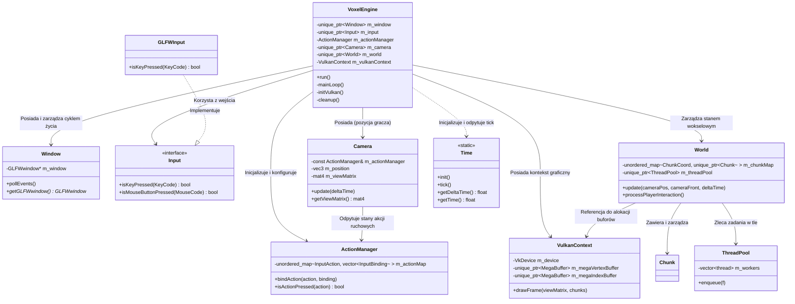
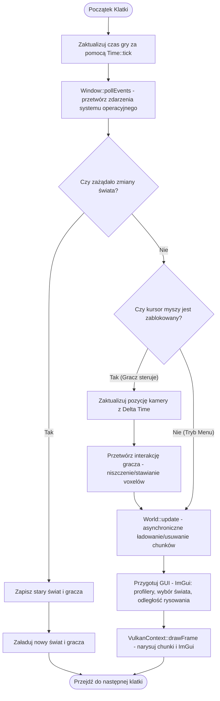

# 🎮 Architektura Ogólna Silnika

Wszystkie komponenty silnika są zdefiniowane i zaimplementowane w przestrzeni nazw **`voxl`**. W tym artykule opisano architekturę silnika **[[api/VoxelEngine|VoxelEngine]]**, cykl życia aplikacji, przebieg pętli głównej (Game Loop) oraz strukturę wejścia i czasu.

---

## 🏗️ Diagram Architektury (Kluczowe Komponenty)

Silnik jest zaprojektowany z wyraźnym podziałem odpowiedzialności. Główną klasą koordynującą jest [[api/VoxelEngine|VoxelEngine]]. Poniższy diagram przedstawia relacje między komponentami w przestrzeni `voxl`:

---

## 🔄 Cykl Życia Silnika i Pętla Główna (Game Loop)

Cykl życia silnika jest zarządzany przez metodę `[[api/VoxelEngine|VoxelEngine]]::run()`:
1. **Inicjalizacja**: Inicjalizowane są globalne punkty czasowe za pomocą `[[api/Time|Time]]::init()`, tworzone są obiekty `[[api/Window|Window]]`, `[[api/Input|Input]]` (GLFWInput), `[[api/Camera|Camera]]` oraz ładowany jest poprzedni stan gracza (`loadPlayerState`).
2. **Inicjalizacja Vulkan**: Wywoływana jest metoda `[[api/VulkanContext|VulkanContext]]::init()`, a następnie inicjalizowany jest obiekt `[[api/World|World]]`.
3. **Pętla Główna**: Metoda `[[api/VoxelEngine|VoxelEngine]]::mainLoop()` działa do momentu zażądania zamknięcia okna.
4. **Czyszczenie**: Bezpieczny zapis stanu gracza, czekanie na zakończenie pracy GPU (`deviceWaitIdle`), resetowanie obiektów świata oraz sprzątanie zasobów Vulkan.

### Przebieg Klatki (Frame Loop)

Każde przejście pętli głównej (`mainLoop()`) wykonuje następujące operacje:

---

## 💾 System Zapisywania Stanu Gracza (Serialization)

Gracz posiada swoją pozycję oraz kąty obrotu kamery (Yaw i Pitch). Stan ten jest utrwalany w pliku binarnym `player.dat` w folderze zapisu konkretnego świata (np. `saves/world1/player.dat`).

### Metody zapisu i odczytu:

* **`[[api/VoxelEngine|VoxelEngine]]::savePlayerState()`**:
  * Zapisuje do pliku pozycję `glm::vec3`, yaw `float`, pitch `float`.
  * Plik jest zapisywany binarnie przy użyciu `std::ofstream`.
* **`[[api/VoxelEngine|VoxelEngine]]::loadPlayerState(worldName)`**:
  * Próbuje wczytać plik `saves/<worldName>/player.dat`.
  * Jeśli plik istnieje, aktualizuje pozycję kamery.
  * Jeśli plik nie istnieje (np. nowy świat), ustawia domyślne współrzędne spawnu: `glm::vec3(1.6f, 1.5f, 5.0f)` oraz obrót `-90.0f` (Yaw) i `-15.0f` (Pitch).

---

## 📁 Struktura Klas Pomocniczych
* **[[api/Window|Window]]**: Opakowanie wokół GLFW. Zarządza szerokością, wysokością, tworzeniem obiektu typu `GLFWwindow*` i niszczeniem okna w destruktorze.
* **[[api/Camera|Camera]]**: Implementuje kamerę typu Euler (Pitch, Yaw, Roll). Oblicza wektory `Front`, `Up` i `Right` na podstawie trygonometrii. Odpowiada za obliczanie macierzy widoku (View Matrix) za pomocą `glm::lookAt` oraz skalowanie ruchu przy użyciu [[api/Time|Time::getDeltaTime()]].
* **[[api/Frustum|Frustum]]**: Klasa wyodrębniająca 6 płaszczyzn bryły widoku ([[api/Frustum|frustum]]) na podstawie macierzy widoku-projekcji. Używana do testowania kolizji z AABB [[api/Chunk|chunków]] (Bounding Box) w celu eliminacji niewidocznych obiektów przed wysłaniem ich do karty graficznej ([[algorithms/Frustum_Culling|culling]]). Więcej informacji znajdziesz w sekcji **[[05_Optymalizacje_i_Wydajnosc]]**.
* **[[api/Time|Time]]**: Statyczna klasa użytkowa, która mierzy Delta Time oraz czas całkowity silnika.
* **ThreadPool**: (Opisana w [[api/World|World]]) Pula wątków roboczych typu MPMC (Multi-Producer Multi-Consumer) zarządzająca asynchronicznymi zadaniami generowania terenu i budowania siatek.

---

> [!NOTE]
> Wszystkie krytyczne błędy podczas cyklu życia silnika są przechwytywane w funkcji `main` ([main.cpp](../../src/main.cpp)), a informacja o nich wypisywana jest na standardowy strumień błędów. Zapewnia to bezpieczne wyjście bez pozostawiania "wiszących" procesów w tle.
