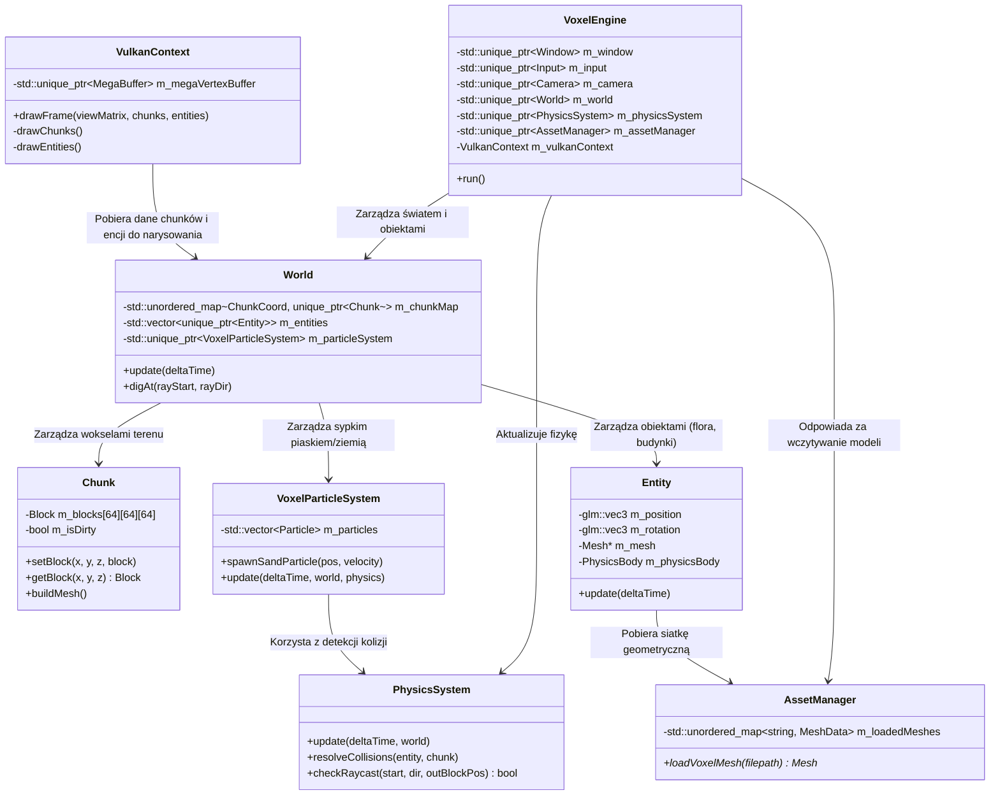
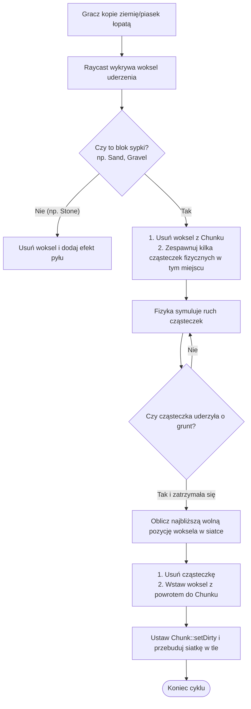

# 🧪 Koncepcja Hybrydowego Silnika Wokselowego z Fizyką

Ta notatka opisuje propozycję rozszerzenia silnika **[[api/VoxelEngine|VoxelEngine]]** do postaci **silnika hybrydowego**. Łączy on zalety dynamicznego terenu opartego o siatkę wokseli z wydajnym renderowaniem wolnostojących, szczegółowych modeli 3D (flory, budynków), a także zintegrowaną fizyką ciał sztywnych i sypkich materiałów.

---

## 🏗️ Proponowany Diagram Architektury Hybrydowej

Poniższy diagram klas przedstawia nowo dodane komponenty i ich integrację z istniejącymi klasami silnika:

---

## 🛠️ Opis Nowych Komponentów

### 1. `AssetManager`
Klasa odpowiedzialna za ładowanie i buforowanie zoptymalizowanych siatek wokselowych (np. wyeksportowanych z MagicaVoxel do formatów `.obj` lub `.gltf`). Zapewnia, że dany model (np. model drzewa o wymiarach 16x16x32 wokseli) jest ładowany do pamięci VRAM tylko raz, niezależnie od liczby jego instancji na scenie.

### 2. `Entity` (Obiekt Gry)
Reprezentuje dowolny niezależny obiekt 3D umieszczony na świecie o precyzyjnych współrzędnych zmiennoprzecinkowych (`glm::vec3`). Każdy obiekt może reprezentować budynek, florę lub pojazd. 
* Posiada wskaźnik do siatki geometrycznej w `AssetManager`.
* Może opcjonalnie posiadać komponent `PhysicsBody`, pozwalający silnikowi fizyki na symulację kolizji, grawitacji i pędu.

### 3. `PhysicsSystem`
Obsługuje detekcję i rozwiązywanie kolizji obiektów dynamicznych z terenem wokselowym oraz innymi encjami.
* **Kolizja AABB z wokselami:** Obliczanie kolizji jest wysoce zoptymalizowane – zamiast testować trójkąty terenu, silnik sprawdza pozycję bounding boxa encji bezpośrednio w strukturze siatki [[api/Chunk|Chunk]].
* **Integracja:** Może bazować na własnej implementacji uproszczonych kolizji lub integrować zewnętrzną bibliotekę (np. Jolt Physics).

### 4. `VoxelParticleSystem`
Zarządza dynamicznymi cząsteczkami fizycznymi generowanymi podczas zniekształcania terenu (kopanie, kruszenie, osypywanie piasku/ziemi).

---

## 🔄 Przepływ Fizyki Sypkich Materiałów (Kopanie i Przesypywanie)

Poniższy schemat przedstawia cykl życia sypkiego bloku (np. piasku) podczas interakcji z łopatą gracza lub z powodu grawitacji:

---

## 💾 Wpływ na Renderowanie (VulkanContext)

Aby obsłużyć tę strukturę w potoku graficznym Vulkan:
1. **Renderowanie terenu:** Siatka terenu wciąż jest generowana za pomocą *Greedy Meshing* w klasach [[api/Chunk|Chunk]] i przesyłana do [[api/MegaBuffer|MegaBuffer]].
2. **Renderowanie obiektów (Instancing):** Wolnostojące obiekty (drzewa, skrzynie) są renderowane w osobnym przebiegu (Render Pass / Dynamic Rendering). Zamiast wysyłać pojedyncze wywołania rysowania dla każdego drzewa, stosujemy **GPU Instancing** – przekazujemy tablicę macierzy transformacji wszystkich instancji tego samego modelu i rysujemy je jednym wywołaniem `vkCmdDrawIndexedInstanced`.
3. **Renderowanie cząsteczek piasku:** Cząsteczki są renderowane jako małe instancjonowane sześciany lub billboardy, co gwarantuje płynność nawet przy tysiącach ziaren na ekranie.
