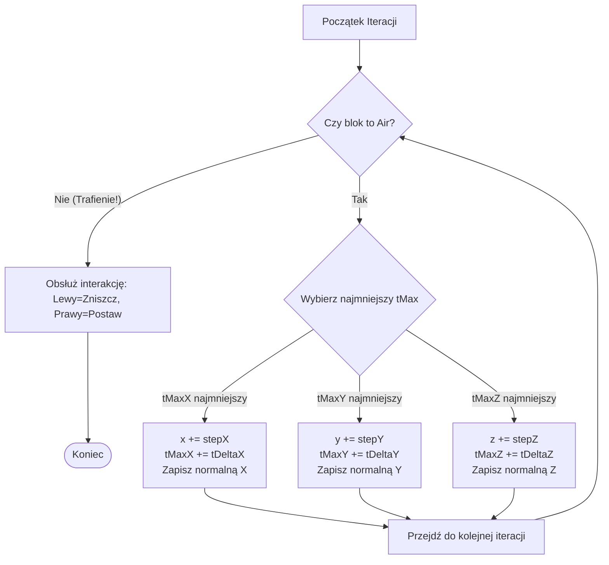

# Raycasting DDA (Digital Differential Analysis)

W silnikach voxelowym sprawdzanie kolizji promienia (wzroku gracza) z siatką bloków za pomocą tradycyjnych testów przecinania trójkątów byłoby zbyt wolne. Zamiast tego [[api/VoxelEngine|VoxelEngine]] implementuje algorytm [[algorithms/Raycasting_DDA|DDA (Digital Differential Analysis)]] przystosowany do siatek trójwymiarowych.

Pozwala on na iterowanie po kolejnych napotkanych voxelach wzdłuż promienia bez pomijania żadnego z nich.

Implementacja znajduje się w pliku [World.cpp](../../src/world/World.cpp) w metodzie [[api/World|World]]::processPlayerInteraction().

---

## 📐 Matematyka i Parametry Algorytmu

Promień definiowany jest przez punkt startowy (pozycja oczu gracza) $\vec{o} = (o_x, o_y, o_z)$ oraz znormalizowany wektor kierunku $\vec{d} = (d_x, d_y, d_z)$. 
Ponieważ jeden voxel w silniku ma fizyczny rozmiar $0.05$ jednostki świata gry, współrzędne pozycji [[api/Camera|kamery]] są najpierw skalowane do współrzędnych siatki:
$$\vec{o}_{grid} = \frac{\vec{o}}{0.05}$$

### Główne zmienne algorytmu:

1. **`x`, `y`, `z`**: Aktualne współrzędne voxela w siatce (liczby całkowite), inicjalizowane jako zaokrąglona w dół pozycja startowa:
   ```cpp
   int x = static_cast<int>(std::floor(rayStart.x));
   ```
2. **`stepX`, `stepY`, `stepZ`**: Kierunek poruszania się wzdłuż osi (wartości $+1$, $-1$ lub $0$), określający czy promień leci w stronę rosnących czy malejących współrzędnych:
   ```cpp
   const int stepX = (rayDir.x > 0) ? 1 : ((rayDir.x < 0) ? -1 : 0);
   ```
3. **`tDeltaX`, `tDeltaY`, `tDeltaZ`**: Dystans, jaki promień musi pokonać wzdłuż swojego kierunku, aby przejść odległość równą szerokości jednego bloku w danej osi:
   $$t\Delta_x = \left| \frac{1}{d_x} \right|$$
   ```cpp
   const float tDeltaX = (stepX != 0) ? std::abs(1.0f / rayDir.x) : std::numeric_limits<float>::max();
   ```
4. **`tMaxX`, `tMaxY`, `tMaxZ`**: Dystans od punktu startowego do najbliższej granicy bloku wzdłuż danej osi.
   ```cpp
   const float nextBoundaryX = static_cast<float>(x) + (stepX > 0 ? 0.5f : -0.5f);
   float tMaxX = (stepX != 0) ? (nextBoundaryX - rayStart.x) / rayDir.x : std::numeric_limits<float>::max();
   ```

---

## 🔄 Pętla Główna Algorytmu (Przyrostowa)

Maksymalny zasięg interakcji gracza z blokami wynosi **20 bloków**. W pętli (maksymalnie 20 iteracji) algorytm sprawdza aktualny blok na pozycji `(x, y, z)`:



Kluczowym elementem jest wybór osi z najmniejszą wartością `tMax` – oznacza to, że promień najszybciej uderzy w ścianę prostopadłą do tej osi. Zwiększając tę wartość o odpowiednie `tDelta`, przechodzimy do kolejnego bloku.

---

## ⛏️ Realizacja Interakcji z voxelami

Gdy algorytm natrafi na blok inny niż `BlockType::Air` (powietrze zdefiniowane w [[api/Chunk|Chunk.h]]):

### 1. Niszczenie bloków (Lewy Przycisk Myszy):
Blok na aktualnie analizowanej pozycji `(x, y, z)` zostaje ustawiony na `[[api/Chunk|BlockType::Air]]`.

### 2. Budowanie bloków (Prawy Przycisk Myszy):
Aby postawić blok, silnik musi wiedzieć, z której strony promień wszedł w voxel (wyznacza to zmienna normalna ściany `lastFaceNormalX/Y/Z`). Nowy blok typu **`[[api/Chunk|BlockType::Stone]]`** stawiany jest na współrzędnych:
$$x_{new} = x - \text{lastFaceNormalX}$$
$$y_{new} = y - \text{lastFaceNormalY}$$
$$z_{new} = z - \text{lastFaceNormalZ}$$

Dodatkowo sprawdzany jest warunek, by nowy blok nie został postawiony bezpośrednio wewnątrz głowy gracza:
```cpp
if (px != camX || py != camY || pz != camZ) {
    setBlockAt(px, py, pz, Block(BlockType::Stone)); // Używa [[api/World|setBlockAt]]
}
```
